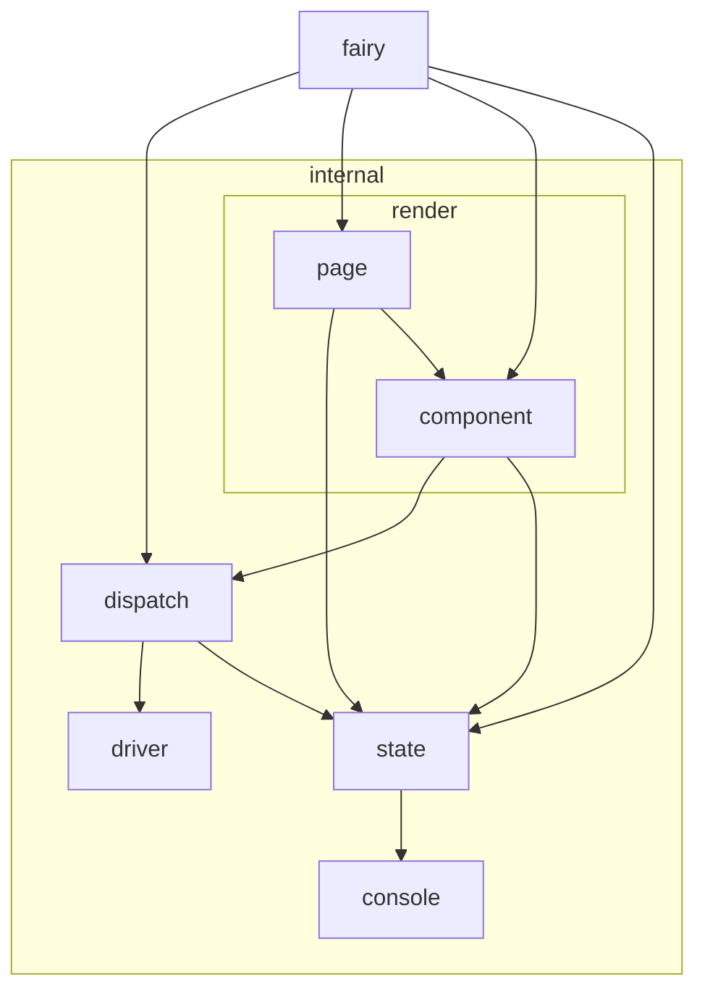

# fairytale
Develop and document Hypp components

## Package dependency graph

```mermaid
flowchart TD

subgraph internal
    dispatch

    subgraph render
        page
        component
    end

    state
    console
    driver
end


fairy --> dispatch
fairy --> page
fairy --> component
fairy --> state

dispatch --> driver
dispatch --> state

component --> dispatch
component --> state

page --> state
page --> component

state --> console
```
