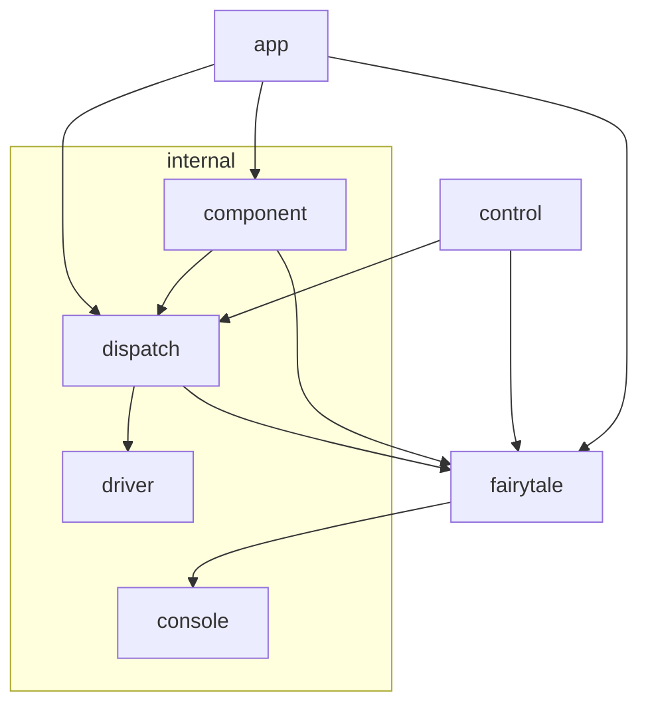

# fairytale
Develop and document [Hypp](https://github.com/macabot/hypp/) components

## Notes
Tale events only work properly if the Tale's state can be fully JSON encoded.
Otherwise, the app in the iFrame isn't able to communicate the changed state to the admin in the top frame.

## TODO
- Add websocket endpoint to implement hot reloading
  - https://gowebexamples.com/websockets/
  - https://github.com/fsnotify/fsnotify

## Package dependency graph

