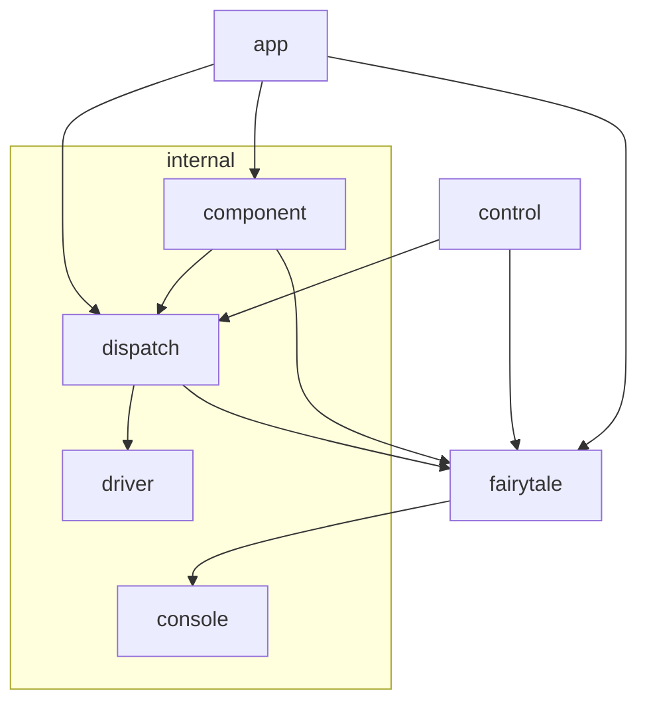

# fairytale
Develop and document [Hypp](https://github.com/macabot/hypp/) components

## Package dependency graph

```mermaid
flowchart TD

subgraph internal
    dispatch
    component
    console
    driver
end


app --> dispatch
app --> component
app --> fairytale

dispatch --> driver
dispatch --> fairytale

component --> dispatch
component --> fairytale

control --> fairytale
control --> dispatch

fairytale --> console
```
